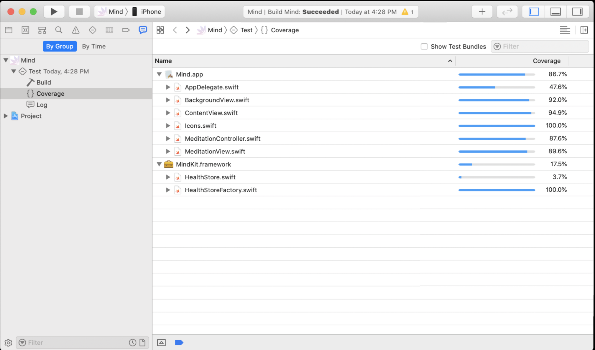

# 初探Test-Driven Development

## 概念
### 什么是TDD
测试驱动开发，英文全称Test-Driven Development，简称TDD，是一种不同于传统软件开发流程的新型的开发方法。它要求在编写某个功能的代码之前先编写测试代码，然后只编写使测试通过的功能代码，通过测试来推动整个开发的进行。这有助于编写简洁可用和高质量的代码，并加速开发过程。

测试驱动开发以测试作为开发过程的开端, 它要求在编写任何产品代码之前,首先编写用于定义产品代码行为的测试, 而编写的产品代码又要以使测试通过为目标。TDD 不是一种开发工具,也不是一种测试方法, 它是一种编码之前进行单元测试的软件开发思想。
### 为什么要TDD
盖房子的时候，工人师傅砌墙，会先用桩子拉上线，以使砖能够垒的笔直，因为垒砖的时候都是以这根线为基准的。TDD就像这样，先写测试代码，就像工人师傅先用桩子拉上线，然后编码的时候以此为基准，只编写符合这个测试的功能代码。

而一个新手或菜鸟级的小师傅，却可能不知道拉线，而是直接把砖往上垒，垒了一些之后再看是否笔直，这时候可能会用一根线，量一下砌好的墙是否笔直，如果不直再进行校正，敲敲打打。使用传统的软件开发过程就像这样，我们先编码，编码完成之后才写测试程序，以此检验已写的代码是否正确，如果有错误再一点点修改。

你是希望先砌墙再拉线，还是希望先拉线再砌墙呢？

## TDD太浪费时间了
实际情况下很少团队会使用TDD，甚至很多项目连单元测试都不会有。主流的想法是测试交给测试来完成，开发者编写测试太浪费时间了。造成这种情况的主要原因如下：

1. 开发者并不习惯TDD这种思想

	现阶段下确实有相当一部分开发者完全没有测试的经验。完全没有接触过测试的开发者确实需要一定的学习时间还有练习量来适应TDD这种开发思想。
2. 比起完全不写测试代码，TDD要求开发者写更多的代码，开发时间也就更长

	对于开发者来说要考虑的事情更多了，需要将实际的需求转化为测试用例，在需求变更的时候需要更新测试用例。不单单要写产品代码，还要先写测试代码。从这个维度上来说工作量确实大了，开发时间也会更长。
	
BUT！
开发并不单单是指开发者拿到需求，根据需求做出来并提交测试这个过程的。除此之外还包括需求变更，代码维护，修复bugs，版本迭代等过程，而TDD在这些过程中是能极大地提高开发效率的，比如说：

1. 在正式环境下收到用户反馈的bug，我们需要大量的时间来分析，定位，修改，并且在修改后还需要相当一段时间的观察。而在TDD思想下开发出的系统，只需要跑一遍相关模块的测试用例，大概就能定位到原因了。
2. 在做功能迭代或者bug修复的时候，我们往往需要仔细思考修改的影响范围，并且在修改过程中需要不断地自测修改到的模块，提交测试时还要备注好可能影响的范围，让QA仔细测试。在这种情况下仍然时不时因为修改代码引发其他的问题，分析后发现是因为对影响范围的评估不到位。而经过TDD思想设计的程序，往往可以放心修改代码，因为影响范围会在单元测试结果中反馈。
3. QA测试提出的bug，有时候我们需要仔细回想当初实现的过程才能定位到并且开始修改。经过的时间越长，回忆需要的时间就越多。而如果能在开发过程中就能发现到bug，就可以大大减少修复的时间。运用TDD往往能让开发者在开发过程中发现bug。

结论：TDD能提高开发效率并且大大减少软件开发的时间。

## 什么时候要用TDD
TDD并不是任何情况都适用的。

#### 不需要TDD的情况
1. 测试项目
2. 内部使用项目
3. 不需要更新迭代的项目
4. 需要快速抢市场的项目的第一个版本

#### 需要TDD的情况
1. 稳定在市场运行的项目
2. 快速发布之后市场反响良好，需要进行后续开发维护

#### 结论
* TDD能在项目开发初期到项目稳定运行之间的任何时间节点运用。但是项目稳定之后再运用TDD就会更加耗费时间，因为往往涉及到项目的重构。
* 一般来说如果软件生命周期持续超过1年，会有好多个版本需要迭代，并且不是需要紧急发布出去抢占市场，比较推荐使用TDD。
* TDD只是一个手段并不是目的，目的是为了让软件具有更高的健壮性以及可扩展性，实际中要根据具体的情况决定什么时候怎么样使用TDD。

## TDD优势

* 明确需求
* 代码耦合度低，测试覆盖率高，提高系统的可扩展性和抗变性
* 极大地降低了后续测试及修复的成本，提高了代码的质量
* 使系统具有与开发同步的文档

## 要测试什么

* 开发者写的非系统或者第三方库提供的代码都需要测试，比如自定义方法，属性的getter和setter
* 不要测试系统提供的代码

	举个例子，测试init()方法或者系统提供的getter，setter是毫无意义的，因为这个工作应该而且已经由java，swift等语言完成。
* 不要测试依赖的代码，比如第三方库

	与上面类似，这些代码应该由库的作者来完成，理想的情况下我们引用的库都应该是有质量保证的，这些库都已经经过有效的测试。
	
	当然也有例外。
	1. 有时候我们第一次接入某个库的时候，需要写一些测试代码来看看这个库是怎么用的。但是这些测试代码不需要长期维护而应该在明确用法之后删除。
	2. 有时候我们选用的库并没有提供可靠的测试，这个时候我们需要测试代码来验证这些库是否如我们预期的运行以提高系统的健壮性。（但是这种情况下我们更应该考虑的是还要不要使用这些库？）

## 流程
1. 写一个失败的测试

	写业务代码之前必须要先写一个失败的测试(编译失败也算失败)
1. 让测试通过
1. 重构
2. 不断重复这个过程

## TDD原则
* **第一步要先写失败的测试**

	永远不会fail的测试是没有任何意义的。先写失败的测试亦即保证了测试的可失败性。
* **写新测试前，就测试必须全部已经通过**

	这样可以保证测试的重复性。不单单在跑正在开发的测试而是在跑所有的测试。
* **每个测试的时间都必须很短**

	上一个原则表明测试是要重复地跑的，如果测试过于耗时会影响开发效率，理论上所有测试加起来都应该在1秒内跑完。
* **重构的时候，要同时更新业务代码和测试代码**

	这样可以保证测试代码是不断维护的。

## 实际开发中的TDD
### 测试代码组织
测试代码也是代码的一种，也需要一定的架构进行组织，一般情况下，测试代码应与业务代码组织尽量接近。方便自己以及同事的阅读维护。
示例：
)

### iOS中的TDD
[XCTest](https://developer.apple.com/documentation/xctest)是Xcode中集成的开发框架，还有其他的第三方框架如[GHUnit](https://github.com/gh-unit/gh-unit)、[OCMock](https://github.com/erikdoe/ocmock
)等，今天不做阐述。
#### XCTest
XCTest是Xcode 5以后集成的测试框架（之前版本是SenTestingKit和OCUnit）。主要功能是进行UI tests以及Unit tests。

* UI tests

	UI tests即UserInterface test，是苹果提供的对视图进行测试的框架。可以对页面显示的任何内容比如文本、图片、自定义视图等进行测试。	
	新建项目时集成UI tests，如下图：

	
	
	给现有项目添加UI tests，如下图：

	
	

	UI tests框架既可以手动编写测试代码，也可以通过录屏的方式让系统自动生成测试代码。

	
<input type="checkbox" check/>演示：手动编写UI tests代码
 
	需求：判断页面中的标签文字
	  
	
		
	
<input type="checkbox" check/>演示：自动生成UI tests代码
 
	需求：增加button，点击button弹出alert，点击alert中的ok，alert消失
	  
	
	#####  小结：
	两个小demo分别展示了手动编写UI tests代码以及自动生成UI tests代码，UI tests常应用于测试界面上的元素是否正常运作。可以看到，由于UI tests需要实际运行并渲染界面以模拟用户使用场景，测试时间长，违反了上面一条[原则](##TDD原则)，所以也有争论说不要对UI进行测试。
	今天只作简单演示，大家有兴趣的话可以下次分享再专门讲。

* Unit tests

	UnitTest叫做单元测试，也叫做模块测试，主要是针对程序模块进行一对一的测试工作。确保每个模块都没有问题，从而提高整体程序的质量。在庞大的系统中，单元测试的数量可能成千上万。今天主要演示Unit tests。
	
	新建项目时集成unit tests，如下图：

	
	
	给现有项目添加unit tests，如下图：

	
	
	下面通过项目来模拟实际开发中运用TDD。

## 实例演示

+ 项目介绍

	竞赛：判断阿拉伯数字转化成罗马数字是否正确，在规定的次数内算出玩家一共答对多少题。
	
	题目页面：
	
	
	分数页面：
	

	
<input type="checkbox" check/>演示：tdd工作流
 
	  

+ 代码覆盖率

	代码覆盖率通常被用来衡量测试的充分性和完整性。统计代码覆盖率的根本目的是找出潜在的遗漏测试用例，并有针对性的进行补充，同时还可以识别出代码中那些由于需求变更等原因造成的不可达的废弃代码。

	通常我们希望代码覆盖率越高越好，代码覆盖率越高越能说明你的测试用例设计是充分且完备的，但你也会发现测试的成本会随着代码覆盖率的提高以类似指数级的方式迅速增加。
	
	

	
<input type="checkbox" check/>演示：代码覆盖率
 
	  

## 总结

测试可以提高软件系统的可靠性，TDD是测试中的一种比较主流的思想，合理运用TDD，可以让软件更健壮。

今天以iOS的角度展示了TDD，UI tests可以测试界面显示以及实际应用场景的流程，Unit tests是测试系统的基础，可靠的测试系统中必定会有大量单元测试，代码覆盖率可以帮助开发者完善测试系统。

希望大家在中可以在合适的时间中运用TDD。

## 参考
* [iOS Test-Driven Development by Tutorials（2019）](https://store.raywenderlich.com/products/ios-test-driven-development)
* [Test Driven Development Tutorial for iOS: Getting Started](https://www.raywenderlich.com/5522-test-driven-development-tutorial-for-ios-getting-started)
* [wwdc测试相关](https://developer.apple.com/videos/developer-tools/testing)
* [测试覆盖率](https://www.jianshu.com/p/775442df2301)
